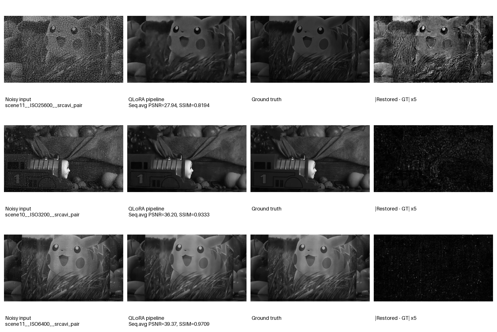
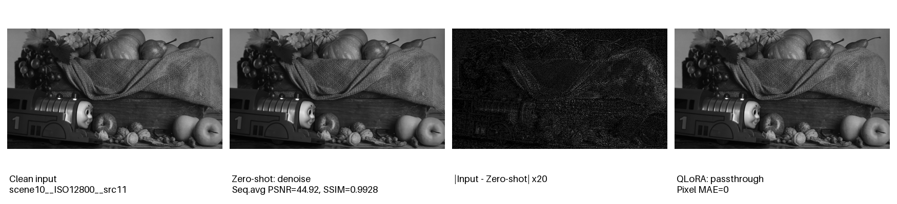

# 基于Qwen2.5-VL的低质视频诊断与自动复原系统

本项目面向辐射视频中的真实噪声退化，使用Qwen2.5-VL分析代表帧，输出结构化诊断结果，并根据诊断自动调用五帧视频去噪模型或执行原图直通。项目覆盖数据构建、Zero-shot基线、4-bit QLoRA微调、模型评测、工具路由、端到端复原和Gradio部署。

## 系统流程

```text
连续视频帧
   ↓
选取中间代表帧
   ↓
Qwen2.5-VL + QLoRA退化诊断
   ↓
结构化JSON：degradation / severity / recommended_tool / reason
   ↓
┌──────────────────┬──────────────────┐
│ recommended_tool │       none       │
│     denoise      │                  │
↓                  ↓                  │
五帧视频去噪       原图无损直通       │
└──────────────────┴──────────────────┘
   ↓
复原序列、诊断报告和运行记录
```

为适配单张RTX 4090，Qwen推理使用NF4 4-bit量化。Pipeline先完成Qwen诊断并释放其进程，再加载视频去噪模型，避免两个模型同时占用显存。

## 数据与划分

训练数据由clean/noisy配对序列构建，标签包括：

- `degradation`：`clean` 或 `noise`
- `severity`：`none`、`mild`、`medium`、`severe`
- `recommended_tool`：`none` 或 `denoise`
- 自然语言诊断原因

数据规模：

| Split | 样本数 | 场景 |
|---|---:|---|
| Train | 2,000 | scene1–scene8 |
| Validation | 250 | scene9 |
| Test | 500 | scene10–scene11 |

训练、验证和测试按场景划分，三者场景交集为空，避免同一场景不同帧进入多个数据划分。

## 模型配置

| 模块 | 配置 |
|---|---|
| 多模态基座 | Qwen/Qwen2.5-VL-7B-Instruct |
| 微调方式 | 4-bit NF4 QLoRA |
| LoRA rank | 8 |
| 训练轮数 | 2 epochs / 500 optimizer steps |
| 计算精度 | BF16 |
| 去噪工具 | 五帧视频去噪网络 |
| 显卡 | NVIDIA GeForce RTX 4090 24 GB |
| 部署 | Gradio + VSCode端口转发 |

QLoRA训练耗时约50分钟，最终训练loss为4.045。量化模型加adapter推理峰值显存约5.84 GB。

## 实验结果

### 退化诊断评测（500帧）

| 方法 | 退化Accuracy | Macro-F1 | 工具Accuracy | 噪声严重度Accuracy | Clean误触发率 | 严格JSON有效率 |
|---|---:|---:|---:|---:|---:|---:|
| Zero-shot | 50.00% | 35.97% | 61.00% | 22.00% | 78.00% | 0.00% |
| QLoRA | **100.00%** | **100.00%** | **100.00%** | **72.80%** | **0.00%** | **100.00%** |

平均诊断延迟由Zero-shot的0.631秒增加至QLoRA的0.824秒，换取稳定的结构化输出和显著更高的路由准确率。

### 端到端工具路由（100个序列）

| 方法 | 总路由准确率 | 噪声召回率 | Clean正确放行率 | Clean误触发率 | Clean原样保留率 |
|---|---:|---:|---:|---:|---:|
| Zero-shot | 65.00% | 100.00% | 30.00% | 70.00% | 30.00% |
| QLoRA | **100.00%** | **100.00%** | **100.00%** | **0.00%** | **100.00%** |

Zero-shot将35/50个干净序列错误送入去噪模型；QLoRA正确处理全部50个噪声序列和50个干净序列。在当前二分类测试集上，QLoRA路由结果与Oracle路由一致。

### 端到端复原质量

以下指标统计每段序列去掉前后各2帧后的有效中心帧：

| 指标 | 原始噪声输入 | QLoRA自动复原 | 改善 |
|---|---:|---:|---:|
| PSNR | 27.7618 dB | **35.2062 dB** | **+7.4445 dB** |
| SSIM | 0.6120 | **0.9089** | **+0.2968** |
| Temporal Difference Error | 0.03816 | **0.01426** | **降低62.6%** |

干净输入的文件级原样保留率为100%，输入输出像素MAE为0。Pipeline评测PSNR与原去噪测试结果35.2373 dB相差约0.031 dB，差异主要来自8-bit PNG保存和评测路径。

## 定性结果
### 噪声视频复原结果



### Zero-shot干净图误触发案例


运行可视化脚本后，将生成：

```text
results/figures_818_v5/
├── noisy_restoration_cases.png
├── clean_false_trigger_case.png
└── figure_manifest.json
```

`noisy_restoration_cases.png`展示三档噪声输入、复原结果、GT和放大误差；`clean_false_trigger_case.png`展示Zero-shot误去噪以及QLoRA原样放行的差异。

## 仓库结构

```text
multimodal-restoration/
├── app/
│   ├── pipeline.py
│   └── gradio_app.py
├── data/qwen_binary_v1/
├── models/
│   └── qwen_diagnoser.py
├── scripts/
│   ├── build_qwen_dataset.py
│   ├── train_qwen_qlora.py
│   ├── evaluate_qwen.py
│   ├── run_pipeline_testset.py
│   ├── evaluate_end_to_end.py
│   └── make_qualitative_figures.py
├── tools/
│   └── video_denoiser.py
├── results/
└── outputs/
```

## 快速运行

### 单序列端到端推理

```bash
HF_HUB_OFFLINE=1 \
TRANSFORMERS_OFFLINE=1 \
CUDA_VISIBLE_DEVICES=0 \
python -u -m app.pipeline \
  --input_dir "/path/to/video/frames" \
  --output_dir "outputs/pipeline_demo" \
  --qwen_script "models/qwen_diagnoser.py" \
  --qwen_adapter "outputs/qwen25vl_binary_qlora_r8_e2/final" \
  --denoise_test_script "/path/to/video_test1210new.py" \
  --denoise_weights "/path/to/video_stack_unet818af7frames5v5balanced.pth"
```

输出包括：

```text
diagnosis.json
restored/*.png
run_report.json
```

### Gradio演示

```bash
NO_PROXY=127.0.0.1,localhost \
no_proxy=127.0.0.1,localhost \
HF_HUB_OFFLINE=1 \
TRANSFORMERS_OFFLINE=1 \
CUDA_VISIBLE_DEVICES=0 \
python -u app/gradio_app.py \
  --qwen_script "models/qwen_diagnoser.py" \
  --qwen_adapter "outputs/qwen25vl_binary_qlora_r8_e2/final" \
  --denoise_test_script "/path/to/video_test1210new.py" \
  --denoise_weights "/path/to/video_stack_unet818af7frames5v5balanced.pth" \
  --allowed_input_root "/path/to/allowed/test/root" \
  --server_name 127.0.0.1 \
  --server_port 7860
```

通过VSCode转发7860端口后，在本地浏览器打开界面。

## 项目亮点

- 完成从数据构建、QLoRA训练、离线评测到端到端部署的完整闭环。
- 在单张RTX 4090上完成Qwen2.5-VL-7B的NF4量化推理与QLoRA训练。
- 通过结构化JSON约束实现稳定工具路由，严格JSON有效率由0提升至100%。
- 将现有视频去噪模型封装为可调用工具，采用进程隔离控制峰值显存。
- 在场景隔离测试集上将工具路由准确率由65%提升至100%，并避免干净输入误处理。
- 支持批量断点续跑、端到端指标统计、定性可视化和Gradio交互演示。

## 当前局限

- 当前诊断任务只覆盖`clean/noise`二分类和一个复原工具。
- 结果来自同一数据体系内的场景隔离测试，仍需外部真实数据验证泛化能力。
- 每次Gradio请求会重新加载Qwen，显存安全但增加启动延迟。
- 严重度准确率为72.8%，仍低于退化类型和工具选择准确率。

后续可增加运动模糊、散焦模糊、JPEG压缩和低照度等退化，并接入Restormer、SwinIR和低照度增强工具，形成真正的多工具复原Agent。

## 简历描述参考

> 基于Qwen2.5-VL-7B构建低质视频诊断与自动复原系统，在RTX 4090上使用NF4 QLoRA完成场景隔离数据微调；设计结构化退化诊断与工具路由机制，将端到端路由准确率由65%提升至100%、严格JSON有效率由0提升至100%，并自动调用五帧视频去噪模型，实现PSNR提升7.44 dB、SSIM提升0.297及时序误差降低62.6%；完成批量评测、显存隔离和Gradio部署。
