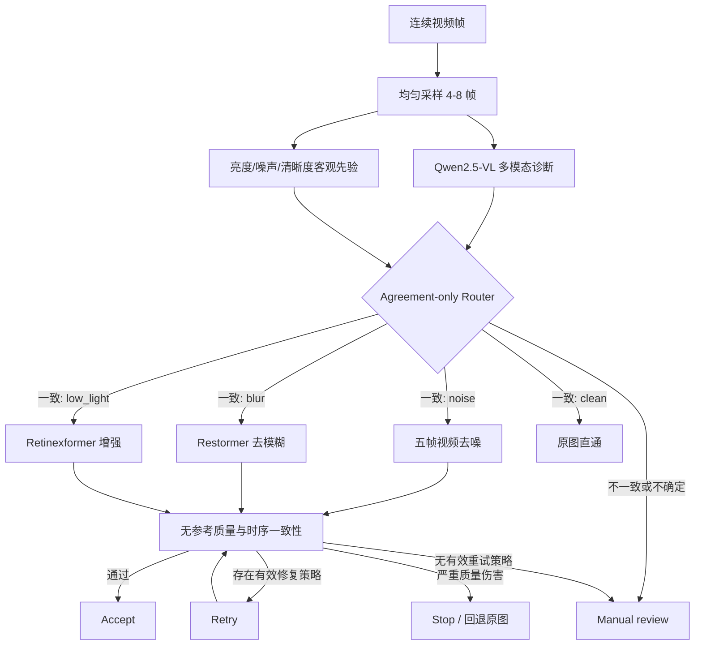

# Memory-Aware Multimodal Video Restoration Agent

面向单张 RTX 4090 的多模态视频复原 Agent：使用 Qwen2.5-VL 诊断视频退化，融合可审计的客观先验进行安全路由，调用去噪、去模糊和低照度增强工具，并通过无参考质量指标与时序一致性构成执行闭环。

> 当前 V2 重点不是追求封闭测试集上的最高分类准确率，而是实现一个可复现、可拒答、可审计、能真实执行复原工具的多模态 Agent。

## 核心能力

- 多退化诊断：支持 `clean / noise / blur / jpeg / low_light / mixed / unknown`。
- 多工具执行：接入五帧视频去噪网络、Restormer 去模糊和 Retinexformer 低照度增强。
- 多帧输入：支持 `single / contact_sheet / native_video` 三种诊断模式。
- 安全路由：Qwen2.5-VL 与客观图像先验一致时自动执行；不一致或证据不足时输出 `manual_review`。
- 闭环质量控制：`诊断 → 路由 → 执行 → 质量评价 → 接受 / 重试 / 人工复核 / 停止`。
- 颜色安全去噪：灰度权重处理亮度通道时保留输入色度，避免彩色视频被错误输出为灰度。
- 单卡部署：大模型与复原工具分阶段加载，避免同时占用显存，已在 RTX 4090 24 GB 上完成完整实验。
- 可审计输出：保留原始 VLM 判断、客观先验、融合来源、路由置信度、工具参数、每次尝试和质量门控结果。

## 系统架构



质量评价不会完全相信大模型的文字判断，而是根据不同工具检查噪声下降、梯度保留、色彩保留、清晰度提升、亮度增益、高光裁剪和归一化帧间残差。彩色输入若在复原后接近灰度，会触发安全停止并回退原始帧。

## V2 冻结测试

### 实验协议

- 冻结标签：`v2.0.0-rc1`
- 冻结提交：`bbe90c02f798a18c4487260863b7e8e2c9e63c66`
- 最终测试集：`gopro_heldout_v2`
- 数据划分：3 个未参与策略开发的 GoPro 场景
- 测试规模：27 个案例，每个案例 5 帧
- 构成：18 个 ID 案例、9 个 OOD 案例
- 诊断模式：`single`
- 融合策略：`agreement_only`
- 最大复原尝试次数：2
- 执行结果：27/27 完成，0 运行失败

代码、提示词、客观先验阈值、质量门控阈值、重试策略和测试场景均在评测前冻结。以下结果未用于反向调参。

### 路由结果

| 指标 | Raw VLM | 融合路由 |
|---|---:|---:|
| 总体精确工具准确率 | 48.1% | **55.6%** |
| ID 精确路由率 | **72.2%** | 50.0% |
| OOD 拒绝率 | 0.0% | **66.7%** |
| 干净视频正确直通率 | 66.7% | 66.7% |
| 干净视频误触发率 | 33.3% | **0.0%** |
| 人工复核率 | 3.7% | 51.9% |

融合策略的主要收益是安全性，而不是无条件提高覆盖率：

- ID 自动覆盖率：55.6%（10/18）。
- 已接受 ID 路由准确率：90.0%（9/10）。
- OOD 正确拒绝：6/9；仍有 3 个 OOD 案例被错误接受。
- 路由阶段自动执行复原工具：8/27。
- 最终自动接受：11/27；最终人工复核：16/27。
- 最终自动接受结果的精确决策正确率：63.6%（7/11）。

这里将拒答计为 ID 精确路由错误，因此融合后的 ID 精确路由率下降到 50.0%。项目不把高人工复核率包装成高准确率，而是同时报告覆盖率和已接受样本的准确率。

### 闭环复原质量

8 个案例实际进入复原工具，其中 6 个通过质量门控，2 个去噪结果因过度平滑转入人工复核。

| 工具 | 执行数 | 接受数 | 人工复核 | 质量通过率 | 平均工具耗时 |
|---|---:|---:|---:|---:|---:|
| Restormer 去模糊 | 2 | 2 | 0 | **100.0%** | 8.438 s |
| 五帧视频去噪 | 3 | 1 | 2 | 33.3% | 1.451 s |
| Retinexformer 低照增强 | 3 | 3 | 0 | **100.0%** | 3.166 s |
| 合计 | 8 | 6 | 2 | 75.0% | 3.841 s |

完整逐案例报告与结构化数据见 [`docs/evaluation/v2/FINAL_EVALUATION.md`](docs/evaluation/v2/FINAL_EVALUATION.md)。

## V1 二分类基线

`v1.0.0` 是 `clean / noise` 二分类基线，包含 Qwen2.5-VL QLoRA、五帧视频去噪和 Gradio 演示。它在同一数据体系内的场景隔离测试集上取得 100% 工具路由准确率，但不包含多退化、OOD 拒答和闭环质量控制，因此不能与 V2 冻结外部分布测试直接比较。

| V1 指标 | 结果 |
|---|---:|
| 测试帧数 | 500 |
| QLoRA 退化分类准确率 | 100.0% |
| QLoRA 工具路由准确率 | 100.0% |
| Clean 误触发率 | 0.0% |
| 去噪 PSNR | 27.7618 → 35.2062 dB |
| 去噪 SSIM | 0.6120 → 0.9089 |
| Temporal Difference Error | 降低 62.6% |

V1 可通过 Git 标签查看：

```bash
git checkout v1.0.0
```

## 工具与策略

| 模块 | 实现 | 作用 |
|---|---|---|
| 多模态诊断 | Qwen2.5-VL-7B-Instruct，NF4 | 输出结构化退化诊断与工具建议 |
| 客观先验 | 亮度、暗像素比例、拉普拉斯方差、噪声估计 | 提供可审计的传统视觉证据 |
| 安全路由 | Agreement-only fusion | 一致时执行，不一致时拒答 |
| 视频去噪 | 五帧 VideoStackUNet | 处理随机噪声 |
| 视频去模糊 | Restormer | 逐帧运动去模糊 |
| 低照增强 | Retinexformer | 逐帧低照度增强 |
| 质量门控 | 无参考指标 + 色彩保留 + 时序残差 | 接受、失败感知重试、复核或停止 |

第三方网络和预训练权重不会提交到本仓库，使用时请遵循各项目的许可证。

## 仓库结构

```text
multimodal-restoration/
├── app/
│   ├── pipeline.py                     # 诊断、路由、执行与闭环控制
│   └── gradio_app.py                   # 交互演示
├── models/
│   ├── qwen_diagnoser.py               # Qwen 多模态诊断
│   └── objective_prior.py              # 客观先验与融合决策
├── tools/
│   ├── video_denoiser.py               # 五帧去噪工具封装
│   ├── restormer_deblur.py              # Restormer 工具封装
│   ├── retinexformer_lowlight.py        # Retinexformer 工具封装
│   └── quality_evaluator.py             # 闭环质量评价
├── scripts/
│   ├── build_heldout_benchmark.py       # 构建冻结测试集
│   ├── run_closed_loop_benchmark.py     # 批量执行闭环测试
│   ├── summarize_heldout_benchmark.py   # 路由报告
│   ├── summarize_closed_loop_quality.py # 质量报告
│   └── summarize_diagnosis_modes.py     # 多帧诊断模式对比
├── benchmarks/
│   └── heldout_v2.json                  # 冻结测试清单
├── docs/evaluation/v2/                  # 最终评测证据
├── third_party/                         # 外部仓库，本地使用且不提交
└── outputs/                             # 本地运行结果，不提交大文件
```

## 环境

项目已验证环境：

| 组件 | 版本或配置 |
|---|---|
| Python | 3.10 |
| PyTorch | 2.5.1 + CUDA 12.1 |
| GPU | NVIDIA GeForce RTX 4090 24 GB |
| Qwen 模型 | Qwen/Qwen2.5-VL-7B-Instruct |
| 量化 | bitsandbytes NF4 4-bit |
| qwen-vl-utils | 0.0.14 |

建议为第三方复原网络固定提交版本和权重校验值。当前实验使用：

- [Qwen2-VL](https://github.com/QwenLM/Qwen2-VL)
- [Restormer](https://github.com/swz30/Restormer)
- [Retinexformer](https://github.com/caiyuanhao1998/Retinexformer)

## 快速运行

### 1. 准备外部工具

```bash
git clone https://github.com/swz30/Restormer.git \
  third_party/Restormer

git clone https://github.com/caiyuanhao1998/Retinexformer.git \
  third_party/Retinexformer
```

根据两个官方仓库的说明安装依赖并下载预训练权重。去噪网络的测试脚本和权重通过命令行参数传入。

### 2. 启动 Gradio 演示

```bash
python -u app/gradio_app.py \
  --qwen_script models/qwen_diagnoser.py \
  --denoise_test_script /path/to/video_test1210new.py \
  --denoise_weights /path/to/video_denoiser.pth \
  --restormer_repo third_party/Restormer \
  --retinexformer_repo third_party/Retinexformer \
  --allowed_input_root /path/to/allowed/input/root \
  --server_name 127.0.0.1 \
  --server_port 7860
```

界面支持上传连续帧或填写白名单内的服务器序列目录，并展示：

- 代表输入帧与最终发布帧；
- VLM 原始判断、客观先验和融合路由；
- 路由置信度、工具选择及每次执行参数；
- 质量门控检查、接受/重试/复核/停止状态；
- 完整 JSON 报告、输出帧画廊与 ZIP 下载。

默认使用 `single` 诊断模式，这是 V2 冻结评测配置。`contact_sheet` 和 `native_video` 用于对比实验。服务端目录输入受 `--allowed_input_root` 限制，队列并发数固定为 1，以适配单张 GPU。

如确需临时公网分享，可附加 `--share`。公开前请确认输入不包含敏感数据，并限制服务开放时间。

### 3. 单个视频帧序列

输入目录应包含按文件名排序的连续图像帧。

```bash
python -u app/pipeline.py \
  --input_dir samples/blur \
  --output_dir outputs/demo_blur \
  --qwen_script models/qwen_diagnoser.py \
  --diagnosis_mode single \
  --diagnosis_frames 5 \
  --fusion_policy agreement_only \
  --denoise_test_script /path/to/video_test1210new.py \
  --denoise_weights /path/to/video_denoiser.pth \
  --restormer_repo third_party/Restormer \
  --retinexformer_repo third_party/Retinexformer \
  --quality_max_attempts 2
```

主要输出：

```text
outputs/demo_blur/
├── diagnosis.json
├── quality_attempt_1.json
├── restored_attempt_1/
├── restored/
└── run_report.json
```

`run_report.json` 包含原始诊断、客观先验、融合策略、决策来源、工具参数、复原尝试、质量检查和最终发布结果。

### 4. 比较多帧诊断模式

```bash
python -u app/pipeline.py \
  --input_dir samples/blur \
  --output_dir outputs/demo_native_video \
  --qwen_script models/qwen_diagnoser.py \
  --diagnosis_mode native_video \
  --diagnosis_frames 5 \
  --fusion_policy agreement_only \
  --denoise_test_script /path/to/video_test1210new.py \
  --denoise_weights /path/to/video_denoiser.pth \
  --restormer_repo third_party/Restormer \
  --retinexformer_repo third_party/Retinexformer \
  --diagnosis_only
```

可将 `native_video` 替换为 `single` 或 `contact_sheet`。

### 5. 复现冻结测试

```bash
python -u scripts/run_closed_loop_benchmark.py \
  --manifest benchmarks/heldout_v2.json \
  --output_root outputs/heldout_v2_reproduction \
  --denoise_test_script /path/to/video_test1210new.py \
  --denoise_weights /path/to/video_denoiser.pth \
  --restormer_repo third_party/Restormer \
  --retinexformer_repo third_party/Retinexformer \
  --mode single \
  --fusion_policy agreement_only \
  --quality_max_attempts 2 \
  --continue_on_error
```

生成报告：

```bash
python scripts/summarize_heldout_benchmark.py \
  --manifest benchmarks/heldout_v2.json \
  --output_root outputs/heldout_v2_reproduction \
  --result_dir results/heldout_v2_reproduction_routing \
  --mode single

python scripts/summarize_closed_loop_quality.py \
  --outputs_dir outputs/heldout_v2_reproduction \
  --result_dir results/heldout_v2_reproduction_quality
```

## 关键失败案例

- 模糊漏检：一个模糊案例中，VLM 与客观先验共同选择 `none`，agreement-only 无法发现共同错误。
- 轻度退化覆盖不足：轻噪声和轻低照度输入经常因为不一致或低置信度而转人工复核。
- 去噪过度平滑：两个强噪声案例虽然噪声显著下降，但梯度保留不足，被质量门控拦截。
- OOD 误接受：一个混合模糊噪声案例被错误路由到去噪并通过质量门控，说明输出质量判断不能替代退化识别。
- JPEG 拒答不足：三个 JPEG OOD 案例中仅一个被正确拒绝。

## 与相关工作的关系

本项目不声称提出首个多 Agent 视频复原框架。MoA-VR 等工作同样研究退化识别、复原路由和质量评价。本项目更强调：

- 单张消费级 RTX 4090 上的可复现实现；
- VLM 与传统图像指标融合的可审计路由；
- 面向未知和混合退化的显式拒答；
- 将失败案例、覆盖率和人工复核成本与准确率同时报告。

相关工作：[MoA-VR](https://arxiv.org/abs/2510.08508)。

## 当前局限与后续工作

- 最终测试使用 GoPro 图像合成退化，尚不能代表真实辐射视频或所有真实相机退化。
- 仅 3 个场景、27 个案例，统计置信度有限。
- Agreement-only 策略较保守，人工复核率达到 51.9%。
- VLM 和客观先验可能产生共同错误，尤其是模糊漏检和 JPEG 直通。
- 当前工具按帧或固定五帧执行，仍缺少更强的长时序建模。
- 无参考质量指标只能检测部分输出伤害，不能证明语义路由正确。
- 灰度去噪权重当前采用“亮度去噪 + 输入色度重组”，能够避免颜色完全丢失，但不等同于联合学习 RGB 噪声分布。
- 下一阶段应在新的开发集上校准轻度退化阈值，并使用完全独立的真实视频数据进行外部测试；不得继续使用 `heldout_v2` 调参。

## 版本

- `v1.0.0`：Qwen2.5-VL 二分类诊断与去噪基线。
- `v2.0.0-rc1`：冻结的多工具、拒答和闭环质量控制候选版本。
- `v2.0.0`：多工具、安全拒答、闭环质量控制与冻结测试报告。
- `feature/v2-gradio-demo`：V2 可审计 Gradio 界面、颜色安全去噪与色彩保留质量门控。

## License

本仓库代码的许可证以仓库中的 LICENSE 文件为准。Qwen2-VL、Restormer、Retinexformer 及各预训练权重分别遵循其原始项目许可证。
